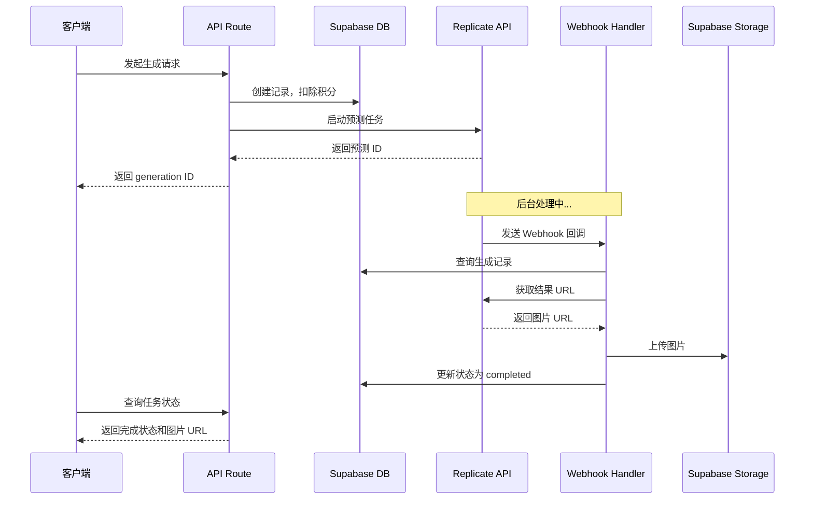
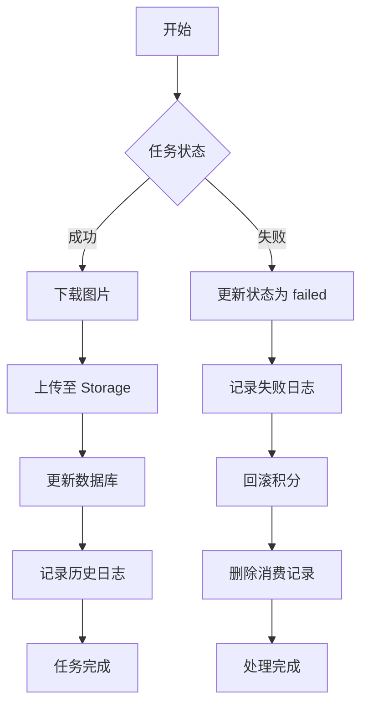

# AI 图像生成平台 - 系统文档

## 📁 项目结构

```
generate_image/
├── app/
│   ├── api/
│   │   ├── generate/
│   │   │   ├── text/
│   │   │   │   └── route.ts          # 文生图（同步）
│   │   │   ├── text-async/
│   │   │   │   └── route.ts          # 文生图（异步）
│   │   │   ├── image/
│   │   │   │   └── route.ts          # 图生图（同步）
│   │   │   ├── image-async/
│   │   │   │   └── route.ts          # 图生图（异步）
│   │   │   ├── style-transfer/
│   │   │   │   └── route.ts          # 风格迁移（同步）
│   │   │   ├── style-transfer-async/
│   │   │   │   └── route.ts          # 风格迁移（异步）
│   │   │   ├── optimize/
│   │   │   │   └── route.ts          # 图像优化（同步）
│   │   │   ├── optimize-async/
│   │   │   │   └── route.ts          # 图像优化（异步）
│   │   │   ├── history/
│   │   │   │   └── route.ts          # 获取生成历史
│   │   │   └── [id]/
│   │   │       ├── route.ts          # 获取/删除单个生成
│   │   │       └── status/
│   │   │           └── route.ts      # 查询任务状态
│   │   └── webhooks/
│   │       └── replicate/
│   │           └── route.ts          # Replicate Webhook 处理器
│   ├── gallery/
│   ├── workbench/
│   ├── layout.tsx
│   └── page.tsx
├── components/
│   ├── gallery/
│   ├── ui/
│   ├── workbench/
│   └── ...
├── lib/
│   ├── api.ts                        # API 工具函数
│   ├── auth.ts                       # 认证工具
│   ├── database.ts                   # 数据库操作
│   ├── replicate.ts                  # Replicate API 集成
│   ├── storage.ts                    # 存储操作
│   ├── supabase.ts                   # Supabase 客户端
│   ├── supabase-server.ts            # 服务端 Supabase 客户端
│   └── utils.ts                      # 通用工具
├── supabase/
│   ├── schema.sql                    # 数据库表结构
│   ├── functions.sql                 # 数据库函数
│   ├── storage.sql                   # 存储配置
│   ├── init.sql                      # 完整初始化脚本
│   ├── seed-data.sql                 # 初始数据
│   └── webhook-schema.sql            # Webhook 支持更新
├── .env.example                      # 环境变量示例
├── .env.local                        # 本地环境变量
├── API_GUIDE.md                      # API 使用指南
└── WEBHOOK_GUIDE.md                  # Webhook 配置指南
```

---

## 🎯 核心功能

### 1. 图像生成模式

#### 同步模式
- **优点**：简单直接，一次请求得到结果
- **适用场景**：快速测试、短时间任务
- **API 端点**：
  - `POST /api/generate/text`
  - `POST /api/generate/image`
  - `POST /api/generate/style-transfer`
  - `POST /api/generate/optimize`

#### 异步模式
- **优点**：支持长任务、Webhook 实时通知
- **适用场景**：生产环境、长时间任务
- **API 端点**：
  - `POST /api/generate/text-async`
  - `POST /api/generate/image-async`
  - `POST /api/generate/style-transfer-async`
- **WebSocket/轮询**：
  - `GET /api/generate/{id}/status`

### 2. Webhook 处理流程



### 3. 错误处理和回滚



---

## 🗄️ 数据库架构

### 表结构

#### users 表
| 字段 | 类型 | 说明 |
|------|------|------|
| id | UUID | 用户 ID |
| email | TEXT | 邮箱（唯一） |
| display_name | TEXT | 显示名称 |
| avatar_url | TEXT | 头像 URL |
| credits | INT | 积分余额 |
| is_admin | BOOLEAN | 是否管理员 |
| created_at | TIMESTAMPTZ | 创建时间 |
| updated_at | TIMESTAMPTZ | 更新时间 |

#### generations 表
| 字段 | 类型 | 说明 |
|------|------|------|
| id | UUID | 生成记录 ID |
| user_id | UUID | 用户 ID |
| prompt | TEXT | 提示词 |
| image_url | TEXT | 生成的图片 URL |
| mode | TEXT | 生成模式 |
| settings | JSONB | 生成参数 |
| replicate_id | TEXT | Replicate 预测 ID |
| status | TEXT | 状态 |
| created_at | TIMESTAMPTZ | 创建时间 |
| updated_at | TIMESTAMPTZ | 更新时间 |

#### transactions 表
| 字段 | 类型 | 说明 |
|------|------|------|
| id | UUID | 交易 ID |
| user_id | UUID | 用户 ID |
| type | TEXT | 交易类型 |
| amount | INT | 金额/积分 |
| stripe_id | TEXT | Stripe 交易 ID |
| description | TEXT | 描述 |
| created_at | TIMESTAMPTZ | 创建时间 |

#### generation_history 表
| 字段 | 类型 | 说明 |
|------|------|------|
| id | UUID | 记录 ID |
| generation_id | UUID | 生成记录 ID |
| status | TEXT | 状态 |
| error_message | TEXT | 错误信息 |
| created_at | TIMESTAMPTZ | 创建时间 |

---

## 🔐 积分系统

### 积分消耗规则

| 操作 | 消耗积分 | 说明 |
|------|----------|------|
| 文生图 | 10 | 标准分辨率 |
| 图生图 | 15 | 包含图像上传处理 |
| 风格迁移 | 20 | 双图像处理 |
| 图像优化 | 5 | 格式转换和压缩 |

### 积分管理

- **扣除时机**：API 请求开始时
- **回滚时机**：任务失败时
- **记录方式**：transactions 表

---

## 🚀 快速开始

### 1. 环境配置

```bash
# 复制环境变量模板
cp .env.example .env.local

# 编辑 .env.local，填写实际值
NEXT_PUBLIC_SUPABASE_URL=your-supabase-url
NEXT_PUBLIC_SUPABASE_ANON_KEY=your-anon-key
SUPABASE_SERVICE_KEY=your-service-key
REPLICATE_API_TOKEN=your-replicate-token
```

### 2. 数据库初始化

1. 打开 Supabase 控制台
2. 进入 SQL 编辑器
3. 按顺序执行以下脚本：

```bash
# 1. 基础表结构
psql -f supabase/schema.sql

# 2. 数据库函数
psql -f supabase/functions.sql

# 3. 存储配置
psql -f supabase/storage.sql

# 4. Webhook 支持
psql -f supabase/webhook-schema.sql

# 5. 初始数据（可选）
psql -f supabase/seed-data.sql
```

### 3. 启动开发服务器

```bash
npm run dev
```

访问 http://localhost:3000

---

## 📡 API 使用示例

### 文生图（异步模式）

```bash
# 1. 发起生成请求
curl -X POST http://localhost:3000/api/generate/text-async \
  -H "Content-Type: application/json" \
  -H "Authorization: Bearer YOUR_TOKEN" \
  -d '{
    "prompt": "A beautiful sunset over mountains",
    "width": 1024,
    "height": 1024
  }'

# 2. 获取响应中的 generation ID
# {"success": true, "data": {"id": "...", "status": "processing"}}

# 3. 查询任务状态
curl -X GET http://localhost:3000/api/generate/{id}/status \
  -H "Authorization: Bearer YOUR_TOKEN"

# 4. 任务完成后获取图片 URL
# {"success": true, "data": {"status": "completed", "image_url": "..."}}
```

### 图生图

```bash
curl -X POST http://localhost:3000/api/generate/image-async \
  -H "Content-Type: application/json" \
  -H "Authorization: Bearer YOUR_TOKEN" \
  -d '{
    "imageUrl": "https://example.com/input.jpg",
    "prompt": "Transform this into a painting",
    "strength": 0.7
  }'
```

### 风格迁移

```bash
curl -X POST http://localhost:3000/api/generate/style-transfer-async \
  -H "Content-Type: application/json" \
  -H "Authorization: Bearer YOUR_TOKEN" \
  -d '{
    "contentImageUrl": "https://example.com/photo.jpg",
    "styleImageUrl": "https://example.com/painting.jpg",
    "styleStrength": 0.8
  }'
```

---

## 🔧 配置 Replicate Webhook

### 方法 1：在 Replicate 控制台配置

1. 登录 Replicate 控制台
2. 进入项目设置
3. 添加 Webhook URL：`https://your-domain.com/api/webhooks/replicate`
4. 选择事件：`completed`, `failed`

### 方法 2：通过 API 配置

```bash
curl -X POST https://api.replicate.com/v1/predictions \
  -H "Authorization: Token YOUR_TOKEN" \
  -H "Content-Type: application/json" \
  -d '{
    "version": "model-version",
    "input": {"prompt": "..."},
    "webhook": "https://your-domain.com/api/webhooks/replicate",
    "webhook_events_filter": ["start", "completed", "failed"]
  }'
```

---

## 📊 监控和日志

### 查看生成历史

```bash
curl -X GET "http://localhost:3000/api/generate/history?page=1&limit=20&mode=text" \
  -H "Authorization: Bearer YOUR_TOKEN"
```

### Webhook 日志

Webhook 处理器会在服务器控制台输出详细日志：

```
Webhook received: {id: "...", status: "succeeded", ...}
Generation found: generation-id
Image downloaded successfully
Uploaded to Supabase Storage
Generation completed: generation-id
```

---

## 🛡️ 安全措施

### 1. 认证
- Bearer Token 认证
- JWT 验证
- 用户隔离（RLS）

### 2. 输入验证
- Zod schema 验证
- 参数类型检查
- 范围限制

### 3. 积分保护
- 预扣积分
- 失败回滚
- 事务记录

### 4. Webhook 安全
- 签名验证（可选）
- 幂等性检查
- 错误处理

---

## 🐛 故障排查

### 常见问题

#### 1. Webhook 未收到
- 检查 Replicate 控制台的 Webhook 配置
- 验证 Webhook URL 可访问
- 检查服务器日志

#### 2. 积分未回滚
- 检查 transactions 表记录
- 验证 update_credits 函数权限
- 查看错误日志

#### 3. 图片上传失败
- 检查 Supabase Storage 配置
- 验证 bucket 权限
- 检查存储配额

#### 4. 任务状态不同步
- 使用 `/api/generate/{id}/status` 手动检查
- 查看 generation_history 表
- 检查 Replicate 预测状态

---

## 📚 更多资源

- [API 使用指南](./API_GUIDE.md)
- [Webhook 配置指南](./WEBHOOK_GUIDE.md)
- [Supabase 文档](https://supabase.com/docs)
- [Replicate 文档](https://replicate.com/docs)
- [Next.js 文档](https://nextjs.org/docs)

---

## 🤝 贡献

欢迎提交 Issue 和 Pull Request！

## 📄 许可证

MIT License
