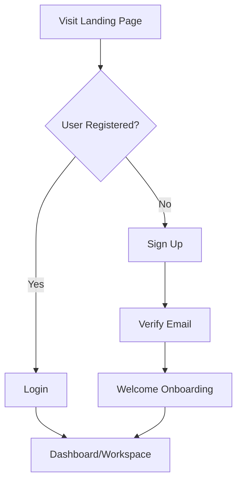
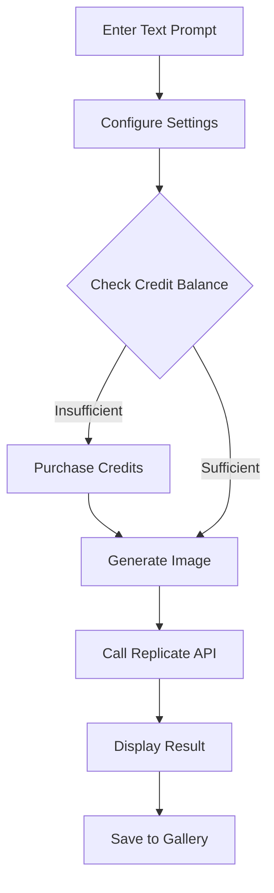
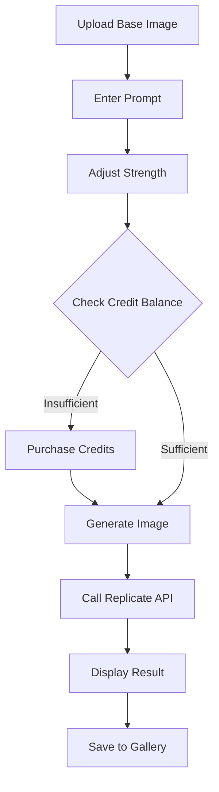
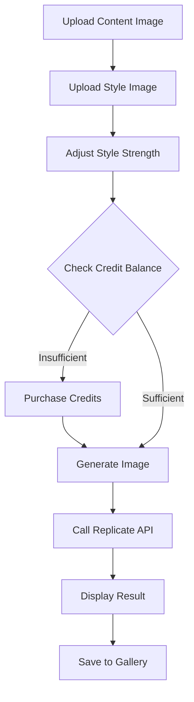
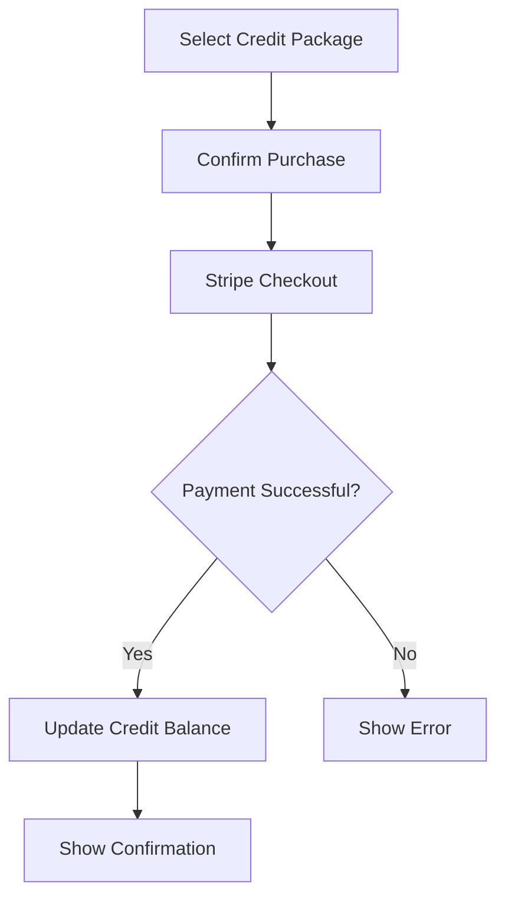
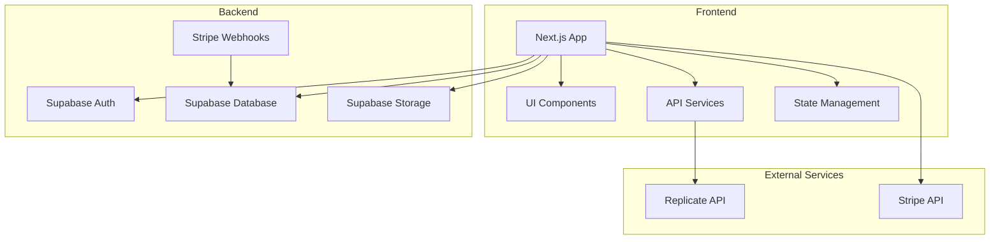
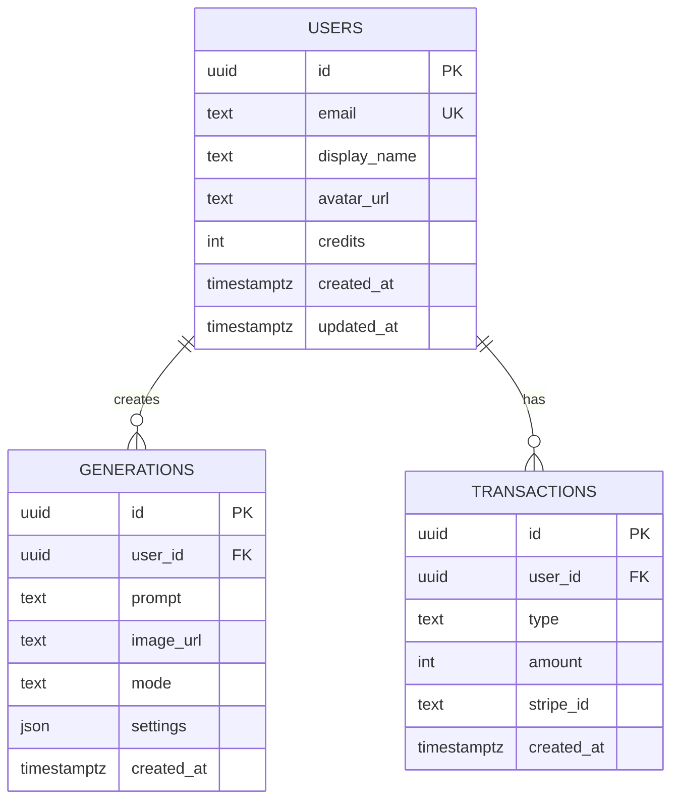

## 1. Product Overview

商业级AI图像生成平台，基于Replicate API和seedream-5-lite模型，为创意工作者、内容创作者和营销人员提供专业的AI图像生成服务。核心价值在于提供角色一致性强的多轮图像编辑能力，支持文生图、图生图、风格迁移和图像优化功能。

## 2. Core Features

### 2.1 User Roles
| Role | Registration Method | Core Permissions |
|------|---------------------|------------------|
| Normal User | Email/Google registration | Browse, generate images, manage gallery, purchase credits |
| Admin | Invitation only | Manage users, view analytics, configure system settings |

### 2.2 Feature Module
1. **Landing Page**: Hero section, feature showcase, pricing plans, CTA
2. **Generate Workspace**: Text-to-image, image-to-image, style transfer, image optimization
3. **Gallery Management**: View, organize, download, delete generated images
4. **User Center**: Profile management, credit balance, purchase history, settings
5. **Pricing Page**: Credit packages, subscription options, feature comparison

### 2.3 Page Details
| Page Name | Module Name | Feature description |
|-----------|-------------|---------------------|
| Landing Page | Hero Section | Animated hero banner with demo generation, main CTA button |
| Landing Page | Features | 4 core feature cards with icons and descriptions |
| Landing Page | Testimonials | User reviews and use case examples |
| Landing Page | Pricing Preview | Quick pricing card with most popular plan |
| Generate Workspace | Text-to-Image | Prompt input, model settings (size, steps, guidance), generate button |
| Generate Workspace | Image-to-Image | Image upload, strength slider, mask editing |
| Generate Workspace | Style Transfer | Content image upload, style image upload, style strength |
| Generate Workspace | Image Optimization | Image upload, format selection (JPEG/PNG/WebP), quality slider |
| Generate Workspace | Generation History | Recent generation results with quick re-generate |
| Gallery Management | Gallery Grid | Masonry grid layout with image thumbnails |
| Gallery Management | Filter/Search | Filter by date, type, tag; search by prompt |
| Gallery Management | Bulk Actions | Select multiple images for download or delete |
| User Center | Profile | Avatar, display name, email, bio |
| User Center | Credit Balance | Current credits, purchase credits button, credit history |
| User Center | Settings | Notifications, privacy, account security |
| Pricing Page | Credit Packages | 3 tier packages (Starter, Pro, Enterprise) |
| Pricing Page | Feature Comparison | Side-by-side feature comparison table |
| Pricing Page | FAQ | Common questions about pricing and credits |

## 3. Core Process

### 3.1 User Registration & Onboarding

### 3.2 Text-to-Image Generation

### 3.3 Image-to-Image Generation

### 3.4 Style Transfer

### 3.5 Credit Purchase Flow

## 4. User Interface Design

### 4.1 Design Style
- **Primary Color**: Deep Purple (#6B21A8) - represents creativity and AI innovation
- **Secondary Color**: Vibrant Cyan (#06B6D4) - accent for CTAs and highlights
- **Neutral Colors**: Dark Slate (#1E1B4B) for backgrounds, Light Gray (#F8FAFC) for content areas
- **Button Style**: Rounded-full (24px radius), gradient backgrounds, hover scale effect
- **Font**: Inter - modern sans-serif, clean and professional
- **Layout**: Card-based design with subtle shadows, generous whitespace
- **Icon Style**: Linear icons from Lucide React, consistent 24px size

### 4.2 Page Design Overview

| Page Name | Module Name | UI Elements |
|-----------|-------------|-------------|
| Landing Page | Hero Section | Full-width gradient background, floating demo cards, animated generation preview |
| Landing Page | Features | 4-column card grid, hover animations, icon + title + description |
| Generate Workspace | Toolbar | Tab navigation for different modes, active state indicator |
| Generate Workspace | Canvas | Large preview area with loading animation, download/share buttons |
| Generate Workspace | Settings Panel | Collapsible panel with sliders, dropdowns, input fields |
| Gallery Management | Grid | Responsive masonry layout, hover overlay with actions |
| User Center | Sidebar | Fixed sidebar navigation, active link highlighting |
| Pricing Page | Cards | 3-column pricing cards, most popular badge, shadow elevation |

### 4.3 Responsiveness
- **Desktop-first approach** with mobile adaptive design
- **Breakpoints**: 1280px (desktop), 1024px (tablet), 640px (mobile)
- **Mobile optimization**: Collapsible navigation, stacked layouts, touch-friendly button sizes (minimum 44px)

### 4.4 Key UI Components
- **Loading States**: Skeleton loaders, animated progress indicators
- **Empty States**: Illustrations with friendly messages for empty galleries
- **Error Handling**: Toast notifications, inline error messages
- **Success Feedback**: Confetti animations for successful purchases/generations

## 5. Technical Architecture

### 5.1 Architecture Design

### 5.2 Technology Stack
- **Frontend**: Next.js 14 + TypeScript + Tailwind CSS 3
- **Authentication**: Supabase Auth
- **Database**: Supabase PostgreSQL
- **Storage**: Supabase Storage
- **Payment**: Stripe
- **AI Model**: Replicate API (seedream-5-lite)
- **Icons**: Lucide React

### 5.3 Route Definitions
| Route | Purpose | Protected |
|-------|---------|-----------|
| / | Landing Page | No |
| /workspace | Generate Workspace | Yes |
| /gallery | Gallery Management | Yes |
| /profile | User Center | Yes |
| /pricing | Pricing Page | No |
| /auth/signin | Sign In | No |
| /auth/signup | Sign Up | No |

### 5.4 Data Model

### 5.5 Credit System
| Action | Credit Cost |
|--------|-------------|
| Text-to-Image Generation | 10 credits |
| Image-to-Image Generation | 15 credits |
| Style Transfer | 20 credits |
| Image Optimization | 5 credits |

### 5.6 Pricing Packages
| Package | Price | Credits | Features |
|---------|-------|---------|----------|
| Starter | $9.99 | 100 | Basic generation, standard resolution |
| Pro | $29.99 | 350 | All features, high resolution, priority queue |
| Enterprise | Custom | Custom | Dedicated API, SLA guarantee, custom models |

## 6. Business Model

### 6.1 Revenue Model
- **Pay-as-you-go**: Users purchase credit packages
- **Volume discounts**: Larger packages offer better credit rates
- **Enterprise subscriptions**: Custom pricing for high-volume users

### 6.2 Target Users
1. **Creative Professionals**: Graphic designers, illustrators, concept artists
2. **Content Creators**: Social media managers, bloggers, video producers
3. **Marketing Teams**: Digital marketers, advertisers, brand managers

### 6.3 Competitive Advantages
- **Role Consistency**: Advanced multi-round editing maintains character consistency
- **Fast Generation**: Leveraging seedream-5-lite for quick results
- **All-in-one Platform**: Text-to-image, image-to-image, style transfer in one place
- **Affordable Pricing**: Flexible credit-based system