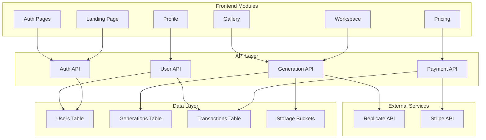
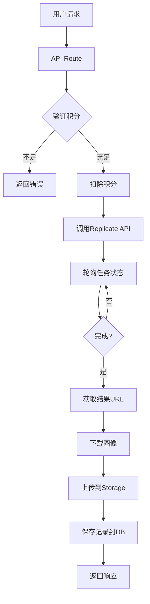
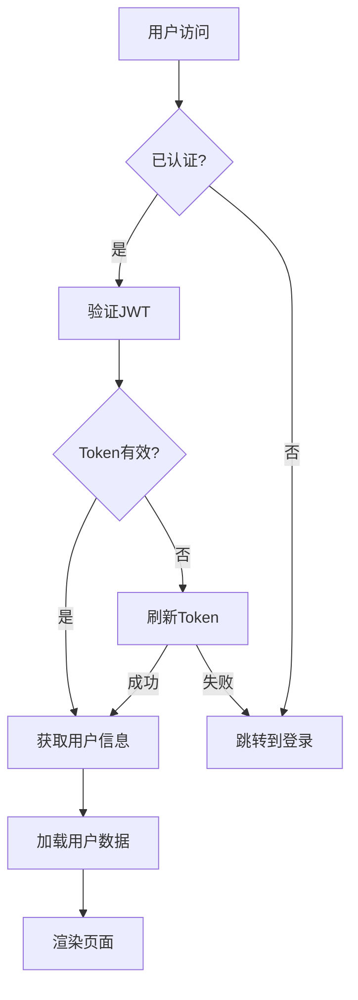
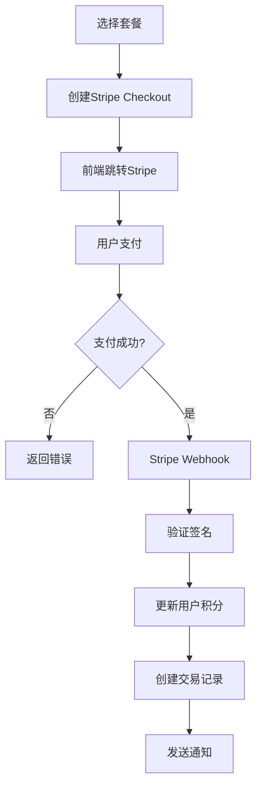
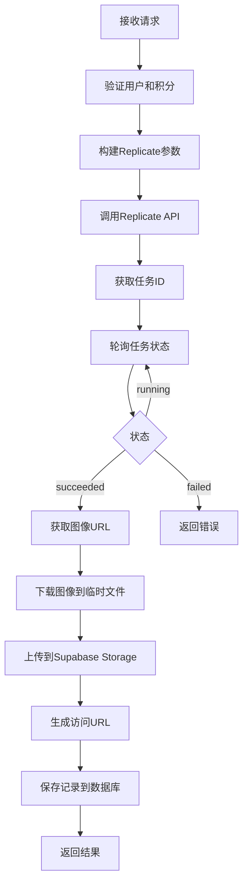

# 技术设计文档

## 1. 系统整体架构设计

### 1.1 架构概述

本系统采用 **Next.js 全栈架构**，结合 Supabase 作为后端服务，实现高效的 AI 图像生成平台。系统分为以下层次：

- **前端展示层**: Next.js + React 组件，提供用户交互界面
- **API 层**: Next.js API Routes，处理业务逻辑和外部 API 调用
- **数据层**: Supabase PostgreSQL 数据库和 Storage
- **外部服务层**: Replicate API（图像生成）、Stripe（支付处理）

### 1.2 模块关系图



### 1.3 核心模块说明

| 模块 | 职责 | 技术实现 |
|------|------|----------|
| **Auth Module** | 用户注册、登录、认证 | Supabase Auth + NextAuth |
| **Generation Module** | 图像生成、编辑、优化 | Replicate API + Next.js API |
| **Payment Module** | 积分购买、支付处理 | Stripe Checkout + Webhooks |
| **Storage Module** | 图像存储、管理 | Supabase Storage |
| **Gallery Module** | 图像展示、管理 | React + Supabase Query |

---

## 2. Replicate API 集成设计

### 2.1 API 接口设计

#### 2.1.1 文生图接口

**POST /api/generate/text**

| 参数 | 类型 | 必填 | 说明 |
|------|------|------|------|
| prompt | string | 是 | 文本提示词 |
| width | number | 否 | 图像宽度（默认1024） |
| height | number | 否 | 图像高度（默认1024） |
| steps | number | 否 | 生成步数（默认30） |
| guidance | number | 否 | 引导系数（默认7.5） |
| seed | number | 否 | 随机种子（默认随机） |

**响应结构:**
```json
{
  "id": "string",
  "status": "pending|processing|completed|failed",
  "imageUrl": "string|null",
  "prompt": "string",
  "settings": {},
  "createdAt": "timestamp"
}
```

#### 2.1.2 图生图接口

**POST /api/generate/image**

| 参数 | 类型 | 必填 | 说明 |
|------|------|------|------|
| imageUrl | string | 是 | 基础图像URL |
| prompt | string | 是 | 文本提示词 |
| strength | number | 否 | 变换强度 0-1（默认0.7） |
| width | number | 否 | 图像宽度 |
| height | number | 否 | 图像高度 |

#### 2.1.3 风格迁移接口

**POST /api/generate/style-transfer**

| 参数 | 类型 | 必填 | 说明 |
|------|------|------|------|
| contentImageUrl | string | 是 | 内容图像URL |
| styleImageUrl | string | 是 | 风格图像URL |
| styleStrength | number | 否 | 风格强度 0-1（默认0.8） |

#### 2.1.4 图像优化接口

**POST /api/generate/optimize**

| 参数 | 类型 | 必填 | 说明 |
|------|------|------|------|
| imageUrl | string | 是 | 原始图像URL |
| format | string | 否 | 输出格式（jpeg/png/webp） |
| quality | number | 否 | 质量 0-100（默认80） |

### 2.2 数据流



### 2.3 Replicate API 调用配置

```typescript
const REPLICATE_MODEL = "stability-ai/stable-diffusion";
const REPLICATE_VERSION = "27b93a2413e7f36cd83da926f3656280b2931564ff050bf9575f1fdf9bcd7478";

interface ReplicateInput {
  prompt: string;
  image?: string;
  width?: number;
  height?: number;
  num_inference_steps?: number;
  guidance_scale?: number;
  seed?: number;
  strength?: number;
}

interface ReplicateOutput {
  id: string;
  status: string;
  output?: string[];
  error?: string;
}
```

---

## 3. 用户认证和权限控制

### 3.1 认证架构



### 3.2 技术实现方案

#### 3.2.1 认证方式

- **主认证**: Supabase Auth（邮箱/密码 + OAuth）
- **会话管理**: NextAuth.js + HttpOnly Cookie
- **Token存储**: JWT Token 在 HttpOnly Cookie 中

#### 3.2.2 权限控制

| 角色 | 权限 |
|------|------|
| **匿名用户** | 访问首页、定价页、登录注册 |
| **认证用户** | 所有功能（受积分限制） |
| **管理员** | 用户管理、系统配置、数据分析 |

#### 3.2.3 中间件实现

```typescript
// middleware.ts
export async function middleware(request: NextRequest) {
  const session = await getServerSession(request);
  
  if (!session) {
    return NextResponse.redirect(new URL('/auth/signin', request.url));
  }
  
  const user = await supabase.from('users').select('*').eq('id', session.user.id).single();
  
  if (!user.data) {
    return NextResponse.redirect(new URL('/auth/signup', request.url));
  }
  
  return NextResponse.next();
}

export const config = {
  matcher: ['/workspace/:path*', '/gallery/:path*', '/profile/:path*']
};
```

---

## 4. 积分系统和支付流程

### 4.1 积分系统设计

#### 4.1.1 积分消耗规则

| 操作 | 消耗积分 | 说明 |
|------|----------|------|
| 文生图 | 10 | 标准分辨率 |
| 图生图 | 15 | 包含图像上传处理 |
| 风格迁移 | 20 | 双图像处理 |
| 图像优化 | 5 | 格式转换和压缩 |

#### 4.1.2 积分余额管理

```typescript
interface CreditTransaction {
  id: string;
  userId: string;
  type: 'purchase' | 'consume' | 'refund';
  amount: number;
  stripeId?: string;
  description?: string;
  createdAt: Date;
}
```

### 4.2 支付流程架构



### 4.3 Stripe 集成设计

#### 4.3.1 创建 Checkout Session

**POST /api/payment/create-checkout**

| 参数 | 类型 | 必填 | 说明 |
|------|------|------|------|
| packageId | string | 是 | 套餐ID（starter/pro/enterprise） |

**响应:**
```json
{
  "sessionId": "string",
  "url": "string"
}
```

#### 4.3.2 Webhook 处理

**POST /api/payment/webhook**

| Stripe Event | 处理逻辑 |
|--------------|----------|
| checkout.session.completed | 增加用户积分，创建交易记录 |
| payment_intent.failed | 记录失败状态，通知用户 |

---

## 5. 图像生成和存储设计

### 5.1 图像生成流程



### 5.2 存储架构

#### 5.2.1 Bucket 结构

```
storage/
├── public/
│   └── generated/
│       └── {user_id}/
│           └── {generation_id}.png
└── private/
    └── temp/
        └── {task_id}.tmp
```

#### 5.2.2 存储策略

| 存储位置 | 访问权限 | 用途 |
|----------|----------|------|
| public/generated | 公开只读 | 用户生成的图像 |
| private/temp | 私有 | 临时下载文件 |

#### 5.2.3 图像格式支持

- **输入**: JPEG, PNG, WebP, GIF
- **输出**: PNG（生成）, JPEG/WebP（优化）
- **最大尺寸**: 2048x2048

---

## 6. 数据库表结构设计

### 6.1 ER 关系图

```mermaid
erDiagram
    USERS ||--o{ GENERATIONS : creates
    USERS ||--o{ TRANSACTIONS : has
    USERS ||--o{ API_KEYS : owns
    GENERATIONS ||--o{ GENERATION_HISTORY : has
    
    USERS {
        uuid id PK
        text email UK
        text display_name
        text avatar_url
        int credits DEFAULT 0
        boolean is_admin DEFAULT false
        timestamptz created_at
        timestamptz updated_at
    }
    
    GENERATIONS {
        uuid id PK
        uuid user_id FK
        text prompt
        text image_url
        text mode
        json settings
        text status
        timestamptz created_at
    }
    
    TRANSACTIONS {
        uuid id PK
        uuid user_id FK
        text type
        int amount
        text stripe_id
        text description
        timestamptz created_at
    }
    
    API_KEYS {
        uuid id PK
        uuid user_id FK
        text key_hash
        text name
        boolean active
        timestamptz created_at
        timestamptz expires_at
    }
    
    GENERATION_HISTORY {
        uuid id PK
        uuid generation_id FK
        text status
        text error_message
        timestamptz created_at
    }
```

### 6.2 表结构详细定义

#### 6.2.1 users 表

| 字段 | 类型 | 约束 | 说明 |
|------|------|------|------|
| id | uuid | PRIMARY KEY | 用户唯一标识 |
| email | text | UNIQUE NOT NULL | 邮箱地址 |
| display_name | text | | 显示名称 |
| avatar_url | text | | 头像URL |
| credits | int | DEFAULT 0 | 积分余额 |
| is_admin | boolean | DEFAULT false | 是否管理员 |
| created_at | timestamptz | DEFAULT now() | 创建时间 |
| updated_at | timestamptz | DEFAULT now() | 更新时间 |

#### 6.2.2 generations 表

| 字段 | 类型 | 约束 | 说明 |
|------|------|------|------|
| id | uuid | PRIMARY KEY | 生成记录ID |
| user_id | uuid | FOREIGN KEY | 用户ID |
| prompt | text | NOT NULL | 提示词 |
| image_url | text | | 图像URL |
| mode | text | NOT NULL | 生成模式（text/image/style/optimize） |
| settings | json | | 生成参数 |
| status | text | DEFAULT 'pending' | 状态 |
| created_at | timestamptz | DEFAULT now() | 创建时间 |

#### 6.2.3 transactions 表

| 字段 | 类型 | 约束 | 说明 |
|------|------|------|------|
| id | uuid | PRIMARY KEY | 交易ID |
| user_id | uuid | FOREIGN KEY | 用户ID |
| type | text | NOT NULL | 交易类型 |
| amount | int | NOT NULL | 金额/积分 |
| stripe_id | text | | Stripe交易ID |
| description | text | | 描述 |
| created_at | timestamptz | DEFAULT now() | 创建时间 |

#### 6.2.4 api_keys 表

| 字段 | 类型 | 约束 | 说明 |
|------|------|------|------|
| id | uuid | PRIMARY KEY | API Key ID |
| user_id | uuid | FOREIGN KEY | 用户ID |
| key_hash | text | UNIQUE NOT NULL | 密钥哈希 |
| name | text | | 密钥名称 |
| active | boolean | DEFAULT true | 是否激活 |
| created_at | timestamptz | DEFAULT now() | 创建时间 |
| expires_at | timestamptz | | 过期时间 |

---

## 7. 前后端 API 定义

### 7.1 认证相关

| 方法 | 路径 | 说明 |
|------|------|------|
| POST | /api/auth/signup | 用户注册 |
| POST | /api/auth/signin | 用户登录 |
| POST | /api/auth/signout | 用户登出 |
| GET | /api/auth/user | 获取当前用户 |

**POST /api/auth/signup**

请求:
```json
{
  "email": "string",
  "password": "string",
  "displayName": "string"
}
```

响应:
```json
{
  "user": {
    "id": "string",
    "email": "string",
    "displayName": "string",
    "credits": 0
  },
  "session": "string"
}
```

### 7.2 图像生成相关

| 方法 | 路径 | 说明 |
|------|------|------|
| POST | /api/generate/text | 文生图 |
| POST | /api/generate/image | 图生图 |
| POST | /api/generate/style-transfer | 风格迁移 |
| POST | /api/generate/optimize | 图像优化 |
| GET | /api/generate/history | 获取生成历史 |
| GET | /api/generate/:id | 获取单个生成记录 |
| DELETE | /api/generate/:id | 删除生成记录 |

### 7.3 支付相关

| 方法 | 路径 | 说明 |
|------|------|------|
| POST | /api/payment/create-checkout | 创建支付会话 |
| POST | /api/payment/webhook | Stripe Webhook |
| GET | /api/payment/history | 获取交易历史 |

### 7.4 用户相关

| 方法 | 路径 | 说明 |
|------|------|------|
| GET | /api/user | 获取用户信息 |
| PUT | /api/user | 更新用户信息 |
| GET | /api/user/credits | 获取积分余额 |
| POST | /api/user/api-key | 创建API密钥 |
| DELETE | /api/user/api-key/:id | 删除API密钥 |

### 7.5 API 响应格式

**成功响应:**
```json
{
  "success": true,
  "data": {},
  "message": "string"
}
```

**错误响应:**
```json
{
  "success": false,
  "error": {
    "code": "string",
    "message": "string"
  }
}
```

---

## 8. 安全设计

### 8.1 输入验证

- 使用 Zod 进行请求参数验证
- 限制上传文件大小（最大10MB）
- 过滤危险字符和脚本注入

### 8.2 数据保护

- 密码使用 bcrypt 哈希存储
- API 密钥使用 SHA-256 哈希存储
- 敏感数据传输使用 HTTPS

### 8.3 权限控制

- 使用 Row Level Security 限制数据访问
- API 端点验证用户身份
- 管理员操作需要额外验证

### 8.4 速率限制

- 图像生成请求每分钟最多5次
- 登录尝试每小时最多10次
- API 密钥请求每小时最多100次